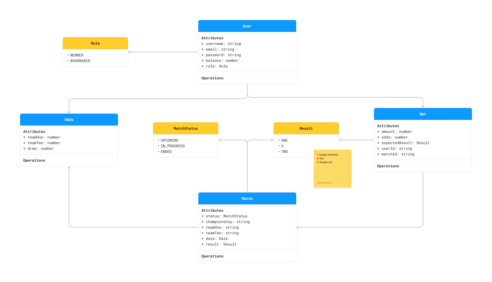
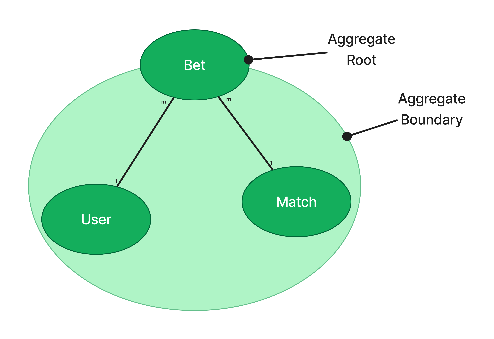

# The Real Deal

## Modélisation

## Use Cases

### Make a bet

Étant donné le DTO arrivant dans le corps de la requête contenant les infos suivantes  : 
- L’ID du match sur lequel le pari veut être fait
- L’ID de l’utilisateur qui fait le pari
- Le montant du pari
- Le résultat escompté

On veut :
- Trouver le match correspondant
- Trouver l’utilisateur correspondant
- Vérifier que le match n’a pas encore commencé
- Vérifier que l’utilisateur à assez de crédits 
- Récupérer les côtes du match
- Calculer la côte correspondante au résultat attendu dans le pari
- Créer le pari
- Déduire la somme du pari dans les crédits de l'utilisateur
- Sauvegarder le pari

